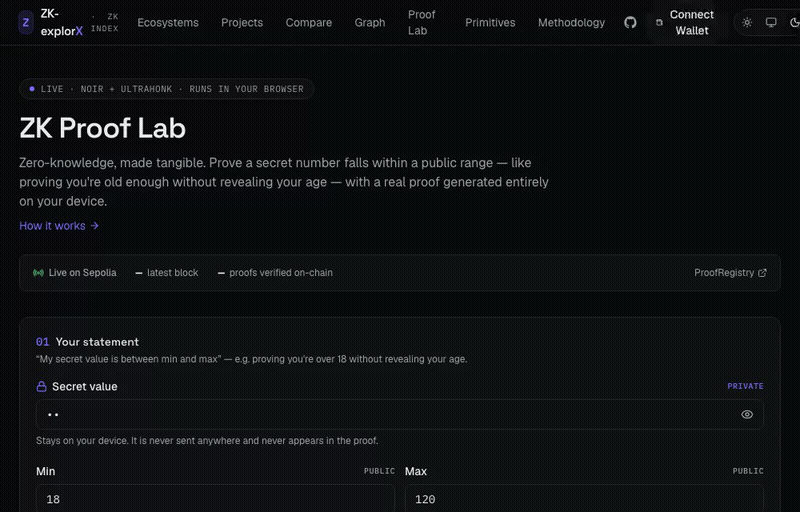

# ZK-explorX

[](https://github.com/AshiqAhamed17/ZK-explorX/actions/workflows/ci.yml)
**[Live app →](https://zk-explorx.vercel.app)**

**The Zero-Knowledge ecosystem explorer — ranked by developer health, not token price. With a real, on-chain-verified ZK proof you can generate in your browser.**

## The problem

Every ZK "ecosystem ranking" that exists today is really a TVL leaderboard —
which chain has the most money parked in it this week. That's a lagging,
mercenary-capital signal. It says nothing about whether a protocol's actual
engineering is alive: is anyone still shipping, are contributors sticking
around, is the codebase being maintained. For developers picking where to
build, researchers tracking the space, and engineers deciding what to learn
next, that's the question that actually matters — and nothing answers it.

ZK-explorX does. It combines **hand-curated protocol research** with **live
GitHub developer activity** into a transparent, weighted Health Score, and
then goes further: an interactive knowledge graph of how ten ecosystems share
languages, VMs, and proving libraries; a side-by-side compare tool; and a real
zero-knowledge proof — generated in your browser, verified on Ethereum
Sepolia — so "zero-knowledge" stops being an abstraction and becomes something
you can watch happen.

## What it does

- **[Health Leaderboard](https://zk-explorx.vercel.app/ecosystems)** — ten ZK ecosystems (ZKsync, Starknet, Scroll, Polygon zkEVM, Linea, Aztec, Aleo, Mina, RISC Zero, SP1) ranked by a transparent, weighted 0–100 score built from live commits, contributors, releases, and issue load — normalized *relative to the tracked set*, not an absolute number that inflates when the whole space is hot.
- **Rich ecosystem dashboards** — curated architecture/proof-system/VM/language facts, a weekly commit-activity chart, a health-component radar, TVL & adoption (for rollups), and a **health-over-time trend chart** backed by a real Postgres history the app writes to itself every day.
- **[Compare](https://zk-explorx.vercel.app/compare)** — put 2–3 ecosystems side by side: overlaid health radar, a metrics table, commit-activity and TVL trend overlays. Shareable via URL.
- **[Project Explorer](https://zk-explorx.vercel.app/projects)** — 60+ curated apps/tools across every ecosystem, filterable by network and category.
- **[Knowledge Graph](https://zk-explorx.vercel.app/graph)** — 40 nodes, 66 edges: every ecosystem plus the languages, VMs, proof systems, and shared proving libraries connecting them (dagre-laid-out, pan/zoom, click-to-focus, filterable by type). The taxonomy is hand-authored — the curated data's `proofSystem`/`vm` fields are free prose, so turning "these four ecosystems all say something different but really all run a zkEVM" into one real shared node is the actual engineering behind this feature.
- **[Primitives & Glossary](https://zk-explorx.vercel.app/primitives)** — SNARK/STARK/PLONK/Groth16/FRI/Halo2, zkEVM/Cairo VM/RISC-V zkVM, and core ZK concepts, cross-linked from every ecosystem page's Proof System/VM facts.
- **[ZK Proof Lab](https://zk-explorx.vercel.app/proof-lab)** — the flagship feature. Prove a private number lies within a public range — "prove you're old enough without revealing your age" — with a real Noir circuit compiled to UltraHonk, proven **entirely client-side in a Web Worker**, then verified **on-chain** against a deployed Solidity verifier on Sepolia via a connected wallet (wagmi + RainbowKit). See **[how it works →](https://zk-explorx.vercel.app/proof-lab/how-it-works)** for the circuit → witness → proof → verification walkthrough.
- **Transparent methodology** — the scoring formula, data tiers, and honest limitations are documented in-app at [`/about`](https://zk-explorx.vercel.app/about).

## Architecture

```
Curated data (Zod)          One hand-authored file per ecosystem — proof
                             system, VM, languages, links, projects.
        │
        ▼
Live data (fetched,         GitHub REST (commits, stars, releases, issues)
ISR-cached 6h)               + DefiLlama (TVL). Best-effort: any failed
                             call degrades gracefully, never breaks a page.
        │
        ▼
Computed (pure fns)         Health Score + Adoption Score — set-relative
                             normalization, unit-tested, no black box.
        │
        ▼
Vercel Cron (daily) ──────▶ Neon Postgres (Drizzle): one ecosystem_snapshots
snapshots today's score     row per ecosystem/day — the "health over time"
for every ecosystem         charts read straight from this table.


ZK Proof Lab (separate pipeline, entirely client-side until the last step)

Noir circuit → witness (browser) → UltraHonk proof (WASM, Web Worker)
      │
      ├─▶ client-side verify (instant, no wallet)
      │
      └─▶ wagmi tx → HonkVerifier.verify() on Sepolia
              → ProofRegistry.submitProof() emits ProofVerified
```

The whole app is **infra-light**: no backend service, no queues. Every live
number a page shows is fetched at request time and cached by Next.js's ISR;
the only stateful piece is a once-a-day cron writing one row per ecosystem to
Postgres, specifically so history charts don't need a backend to exist.

## Why I built this

I wanted a project that forced me to actually *do* the things a ZK/blockchain
role asks for, not just talk about them: write and test a real Noir circuit,
generate a real proof client-side, deploy and verify against it on a live
testnet with a connected wallet — while also building the kind of data-heavy,
production-shaped frontend (live external APIs, a real datastore, careful
caching, an interactive graph) that a generic SDE or infra role cares about.
The Health Score itself came from a genuine annoyance: every "ecosystem
comparison" I could find was really just a TVL chart, and TVL tells you
nothing about whether a codebase is alive. So I built the thing I actually
wanted to look at.

## Demo



A real Noir circuit, compiled to UltraHonk, proving and verifying entirely client-side — no wallet needed for this part. Try it yourself at the [live app](https://zk-explorx.vercel.app/proof-lab), including the on-chain submission step this GIF stops short of (that needs a connected wallet).

## Tech stack

- **Next.js 16** (App Router, Turbopack) + **React 19** + **TypeScript**, deployed on Vercel
- **Tailwind CSS v4** + a small in-repo component set, dark-first
- **Zod** — single source of truth for curated data validation (fails the build on bad data)
- **Recharts** for charts, **[@xyflow/react](https://reactflow.dev)** + **dagre** for the knowledge graph
- **Vitest** for unit tests (health scoring, adoption scoring, data/glossary validation, graph integrity, layout determinism)
- **Noir** + **Barretenberg (bb.js)** — the ZK circuit and UltraHonk prover, run as WebAssembly in a Web Worker
- **Foundry** (forge) — the generated Solidity verifier + a hand-written `ProofRegistry` wrapper
- **wagmi v2 + viem + RainbowKit** — wallet connection and on-chain proof submission
- **Drizzle ORM + Neon Postgres** (`neon-http`, serverless-friendly) — daily health-score snapshots for history charts
- Live data via the **GitHub REST API** and **DefiLlama**, cached with Next.js ISR (6h)

## Getting started

```bash
npm install
cp .env.example .env.local   # then add a GITHUB_TOKEN (see below)
npm run dev                  # http://localhost:3000
```

Everything renders and most features work with just `GITHUB_TOKEN` set. Wallet
connection, on-chain proof submission, and history charts need the additional
env vars documented in `.env.example` (`NEXT_PUBLIC_WALLETCONNECT_PROJECT_ID`,
`DATABASE_URL`, `CRON_SECRET`) — see that file for exactly what each is for
and where to get it.

### GitHub token (required for live data)

Live developer metrics come from the GitHub API. Without a token you're limited to 60 requests/hour (anonymous), which is not enough to populate all ecosystems — pages will render but show degraded/partial data. Create a read-only token at <https://github.com/settings/tokens> (no scopes needed for public repos) and put it in `.env.local`:

```
GITHUB_TOKEN=ghp_xxx
```

### Noir toolchain (only needed if you're editing the ZK circuit)

The ZK Proof Lab's circuit (`circuits/range_proof/`) is written in [Noir](https://noir-lang.org) and compiled with `nargo`, a separate Rust-based CLI — **not an npm package**. The compiled artifact (`circuits/range_proof/target/range_proof.json`) is committed to the repo, so **running the app, building it, or deploying to Vercel never requires `nargo`** — only the JS proving libraries (`noir_js`/`bb.js`) are needed at runtime, and those are plain npm packages.

You only need `nargo` if you're changing the circuit itself:

```bash
curl -L https://raw.githubusercontent.com/noir-lang/noirup/refs/heads/main/install | bash
noirup -v 1.0.0-beta.25   # pin to match this repo's noir_js/acvm_js/noirc_abi versions
cd circuits/range_proof
nargo test                 # run the circuit's unit tests
nargo compile               # regenerate target/range_proof.json after any changes
```

## Scripts

| Script | Purpose |
|---|---|
| `npm run dev` | Start the dev server |
| `npm run build` | Production build (also typechecks) |
| `npm test` | Run the Vitest unit suite |
| `npm run test:e2e` | Run Playwright e2e smoke tests (needs `npm run build` first) |
| `npm run data:validate` | Validate all curated ecosystem data against the Zod schema |
| `npm run lint` | ESLint |
| `npm run deploy:sepolia` | Deploy the ZK Proof Lab contracts to Sepolia (see below) |
| `npm run db:generate` / `db:migrate` / `db:studio` | Drizzle schema migrations / studio |

## How it's organized

```
circuits/
└── range_proof/             # Noir circuit: proves a private value is in a public range
    ├── src/main.nr
    └── target/range_proof.json   # compiled ACIR artifact, committed (no nargo needed at build time)
contracts/                   # Foundry project: generated verifier + hand-written ProofRegistry
db/                          # Drizzle schema, client, migrations (Neon Postgres)
src/
├── app/                     # routes — /, /ecosystems[/[slug]], /compare, /projects,
│                             #   /graph, /primitives, /proof-lab[/how-it-works], /about,
│                             #   /api/cron/snapshot
├── components/
│   ├── ui/                  # Badge, Card primitives
│   ├── charts/              # Sparkline, CommitActivity, HealthRadar, TvlArea, HistoryLine
│   ├── graph/                # EcosystemGraph, custom node, legend/filter
│   ├── compare/, projects/, proof-lab/, wallet/, ecosystem/
├── data/
│   ├── schema.ts, glossary.ts   # Zod schemas — single source of truth for types
│   ├── ecosystems/              # one curated file per ecosystem
│   └── graph.ts                  # knowledge-graph nodes/edges (derived + hand-authored)
├── lib/
│   ├── github.ts, defillama.ts  # live-data clients (ISR-cached, graceful fallback)
│   ├── health.ts, adoption.ts   # pure, unit-tested scoring engines
│   ├── metrics/                  # shared snapshot computation + history query
│   ├── graph-layout.ts           # dagre layout for the knowledge graph
│   ├── circuits/, contracts/, wagmi/   # ZK proving, on-chain ABIs, wallet config
└── workers/prove.worker.ts   # proof generation off the main thread
```

## The Health Score

A 0–100 score computed from five weighted components — Developer Activity (30%), Momentum (20%), Community (20%), Maintenance (15%), Breadth (15%) — each normalized *relative to the tracked set*. See [`src/lib/health.ts`](src/lib/health.ts) and the in-app methodology page at `/about`.

## ZK Proof Lab — on-chain verification

The Proof Lab generates a real zero-knowledge proof **in your browser** (a Noir
range-proof circuit, proven with Barretenberg's UltraHonk via WebAssembly in a
Web Worker) and verifies it **on-chain** on Ethereum Sepolia. See
[how it works](https://zk-explorx.vercel.app/proof-lab/how-it-works) for the
full circuit → witness → proof → verification walkthrough.

**Live contracts (Sepolia):**

| Contract | Address |
|---|---|
| `ProofRegistry` | [`0x43d72f44622E6De811C626760004bA621ee474a9`](https://sepolia.etherscan.io/address/0x43d72f44622E6De811C626760004bA621ee474a9) |
| `HonkVerifier` | [`0xca1B13809576a4103Ce306027fDB327ef577b382`](https://sepolia.etherscan.io/address/0xca1B13809576a4103Ce306027fDB327ef577b382) |

`submitProof(proof, publicInputs)` verifies the proof through the generated
UltraHonk verifier and, on success, emits `ProofVerified` — a real state-changing
transaction ([example](https://sepolia.etherscan.io/tx/0x1a4ac7f46e65fb771d2f9f2e845b15abb3195d6afac1945feb960a255587fad3)).
Addresses and ABIs live in [`src/lib/contracts/verifier.ts`](src/lib/contracts/verifier.ts);
the full deploy record is in [`contracts/deployments/sepolia.json`](contracts/deployments/sepolia.json).

### Redeploying the contracts

You don't need to — they're already deployed. To deploy your own copy:

1. Create a **throwaway** wallet and fund it with Sepolia faucet ETH. Never use
   a real/mainnet key.
2. Put the key in `.env.local` (which is gitignored — **never commit a key**):
   ```
   PRIVATE_KEY=0x...        # throwaway deployer, testnet ETH only
   PUBLIC_KEY=0x...         # its address (cross-checked by the script)
   SEPOLIA_RPC_URL=...      # optional; defaults to a public RPC
   ```
3. Build the contracts and deploy:
   ```bash
   forge build                 # needs Foundry (see contracts/README.md)
   npm run deploy:sepolia
   ```
   The script deploys the verifier's libraries (`RelationsLib`,
   `ZKTranscriptLib`), links and deploys `HonkVerifier`, then deploys
   `ProofRegistry` wired to it — printing the addresses and Etherscan links.
4. Copy the new addresses into `src/lib/contracts/verifier.ts`.

## Deployment

Deploys to Vercel with zero config. Set `GITHUB_TOKEN`, `DATABASE_URL`, `NEXT_PUBLIC_WALLETCONNECT_PROJECT_ID`, and `CRON_SECRET` as environment variables in the Vercel project settings (see `.env.example` for what each one is for).

### Historical snapshots (cron)

`vercel.json` registers a daily cron (`0 3 * * *`, UTC) hitting `/api/cron/snapshot`, which persists that day's health score + key metrics for every ecosystem to Postgres (`ecosystem_snapshots`) — the data source for the "health over time" charts. The route is a no-op if it's re-run for a date that already has rows, and it 401s unless called with `Authorization: Bearer $CRON_SECRET`, which Vercel sets automatically from the env var of the same name.

## Roadmap

Shipped: the health leaderboard, per-ecosystem dashboards with history trends,
a project explorer, live TVL/adoption, side-by-side compare, an interactive
knowledge graph, a primitives glossary, and the ZK Proof Lab with real on-chain
verification. Planned next: full-text/command-K search.
